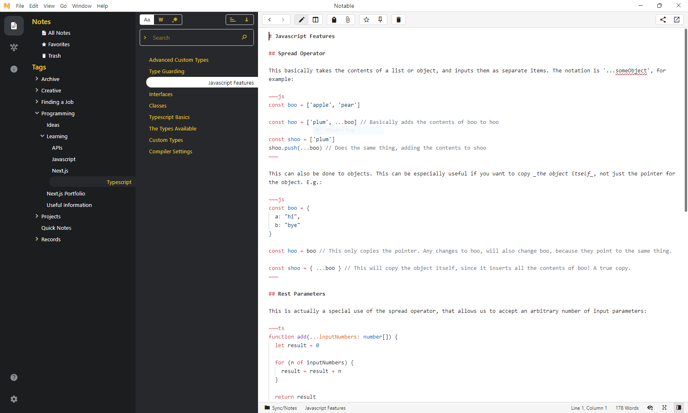

# Bumblebee Theme

Literally just a pretty custom theme, for the Notable note-taking app.

## Installation
This uses custom CSS rather than the theme system, so you need to copy-paste the contents of the CSS file into File -> Preferences -> Custom CSS/JS
